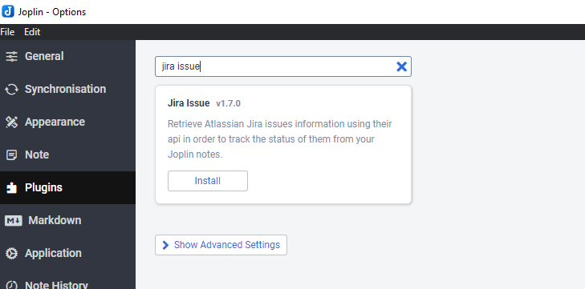
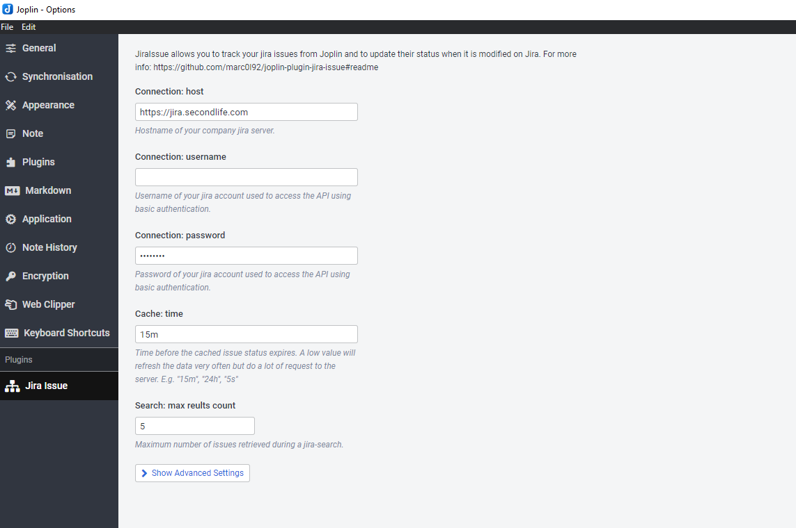
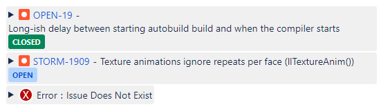
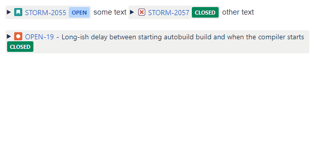
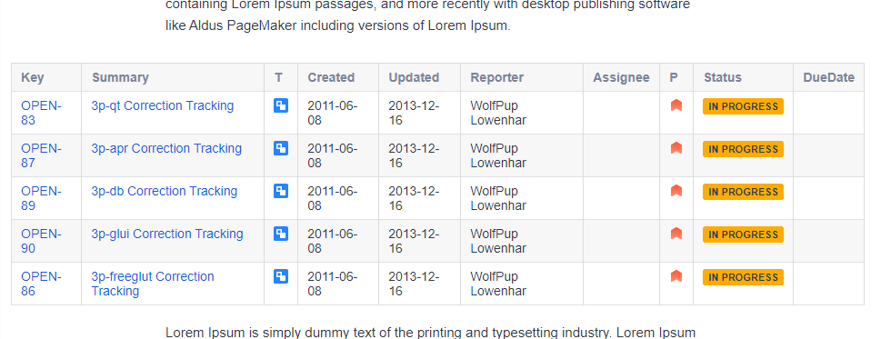
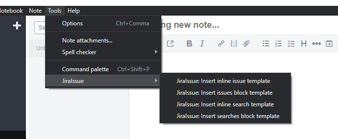
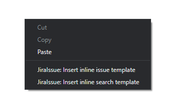

# Joplin Plugin - Jira Issue

> WARNING: I moved my notes to Obsidian.md and I will not provide additional support to this plugin.
> Pull requests are welcome.

This plugin allows you to track the progress of [Atlassian Jira](https://www.atlassian.com/software/jira) issues from your [Joplin](https://joplinapp.org/) notes.

<a href='https://ko-fi.com/marc0l92' target='_blank'></a>

## 1. Install the plugin
### Automatic installation
Use the Joplin plugin manager to install it (`Joplin > Options > Plugins`)



### Manual installation

- Download the last release from this repository.
- Open `Joplin > Options > Plugins > Install from File`
- Select the jpl file you downloaded.

## 2. Configure connection
In the option menu you must configure the connection to your company Atlassian Jira server: host, username and password.

There are three authentication methods:

- Open: username and password fields must be empty.
- [Basic](https://datatracker.ietf.org/doc/html/rfc7617): username and password fields must be filled.
- [Bearer](https://datatracker.ietf.org/doc/html/rfc6750): username field must be empty and password field must contain the token.



## 3. Markdown syntax

### Issues tracking
Is it possible to track an issue in two ways:

<table>
<tr>
<th>Type</th>
<th>Markdown Syntax</th>
<th>Rendering</th>
</tr>
<tr>
<td>Inline</td>
<td><pre>&lt;JiraIssue key="STORM-2055"&gt;</pre></td>
<td></td>
</tr>
<tr>
<td>Block</td>
<td><pre>```jira-issue
OPEN-19
# This is a comment
https://jira.secondlife.com/browse/STORM-1909
STORM-2334
```</pre></td>
<td></td>
</tr>
</table>

In order to view more details about the issue it is possible to expand it:



### JQL Search
Is it possible to show the results of JQL query in a table using one of the following syntax
```
<JiraSearch jql="resolution = Unresolved AND assignee = currentUser() AND status = 'In Progress' order by priority DESC">
```
<pre>```jira-search
# This is a comment
resolution = Unresolved AND assignee = currentUser() AND status = 'In Progress' order by priority DESC
# Here another query
status = 'Open' order by priority DESC
```</pre>



## Menu shortcuts
If you don't remember the syntax to create a JiraIssue or a JiraSearch block you can use the templates in the tools menu and context menu






## Extra hints
- If you need to use the double quotes (`"`) in the JiraSearch inline query you can replace them with (`'`) or the html tag `&quot;`
- The tag names are case insensitive
- This plugin is modifying the HTML rendering of the markdown so the WYSIWYG editor is not supported


# Development
If you want to contribute to this plugin you can find here some useful references:

- [Joplin - Getting started with plugin development](https://joplinapp.org/api/get_started/plugins/)
- [Joplin - Plugin API reference](https://joplinapp.org/api/references/plugin_api/classes/joplin.html)
- [Joplin - Data API reference](https://joplinapp.org/api/references/rest_api/)
- [Joplin - Plugin examples](https://github.com/laurent22/joplin/tree/dev/packages/app-cli/tests/support/plugins)

## Knows issues to compile the plugin
In case of node.js v17 or above, set this flag to install the dependencies while running them with git bash:
```bash
export NODE_OPTIONS=--openssl-legacy-provider
npm install
```

