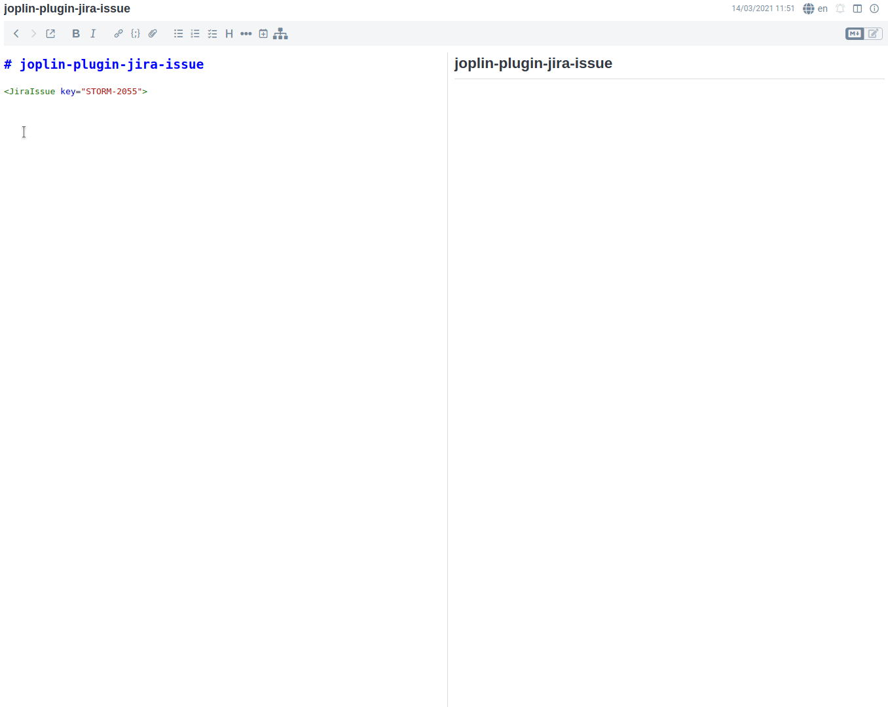

# Joplin Plugin - Jira Issue

This plugin allows you to track the progress of [Atlassian Jira](https://www.atlassian.com/software/jira) Issues from your [Joplin](https://joplinapp.org/) notes.

## Manual Installation

- Download the last release from this repository.
- Open `Joplin > Options > Plugins > Install from File`
- Select the jpl file you downloaded.

## Usage
### Configuration
In the settings is it possible to define how to connect to the Jira server and what are the property to show.


### Issues tracking
To start tracking a new issue use the HTML Tag:
```md
<JiraIssue key="AAA-123">
```
and then use the JiraIssue:Refresh button to download the last issue information.

## JQL Search/Filter
Is it possible to define a search/filter using a JQL query. Use the HTML Tag:
```md
<JiraSearch jql="resolution = Unresolved AND assignee = currentUser() order by priority DESC" max="10"></JiraSearch>
```
to define the query and the max number of results to display.

## Usage Example



# Development
If you want to contribute to this plugin you can find here some userful references:

- [Joplin - Getting started with plugin development](https://joplinapp.org/api/get_started/plugins/)
- [Joplin - Plugin API reference](https://joplinapp.org/api/references/plugin_api/classes/joplin.html)
- [Joplin - Data API reference](https://joplinapp.org/api/references/rest_api/)
- [Joplin - Plugin examples](https://github.com/laurent22/joplin/tree/dev/packages/app-cli/tests/support/plugins)


# Future imrpvements
- [ ] Handle request timeout
