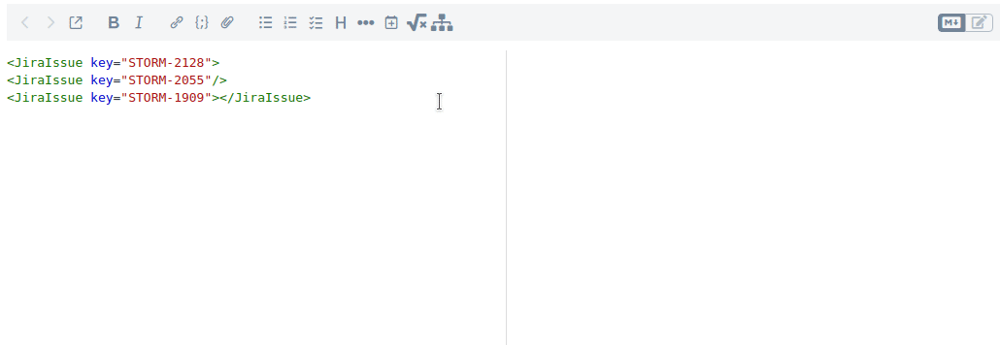
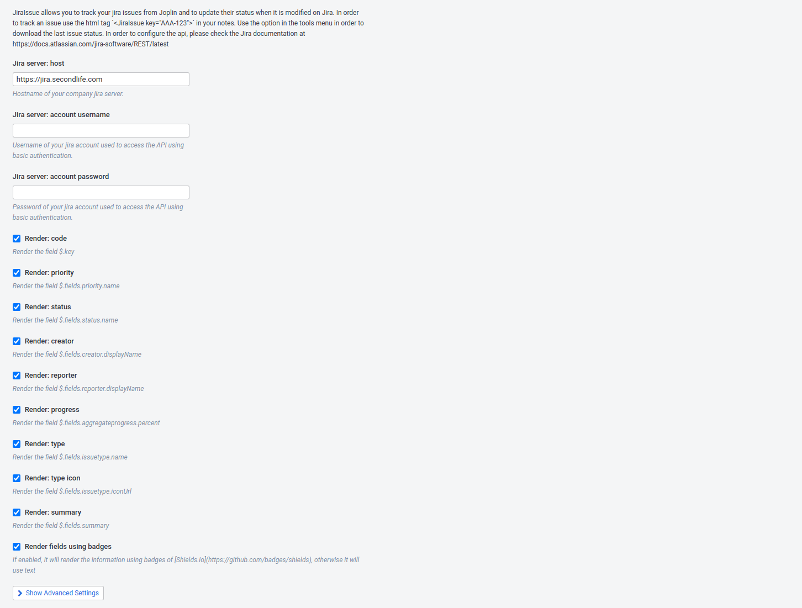

# Joplin Plugin - Jira Issue

This plugin allows you to track the progress of [Atlassian Jira](https://www.atlassian.com/software/jira) Issues from your [Joplin](https://joplinapp.org/) notes.

## Usage
To start tracking a new issue fist configure your Jira server settings in the options.
Then, add a JiraIssue html tag to your notes with the Issue key:
```md
<JiraIssue key="AAA-123">
```
Finally, retrieve the last issue status:


## Settings
In the settings is it possible to define how to connect to the Jira server and what are the property to show.



## TODO
- [ ] Handle multi language settings
- [ ] Allow custom properties
- [ ] Allow custom output format
